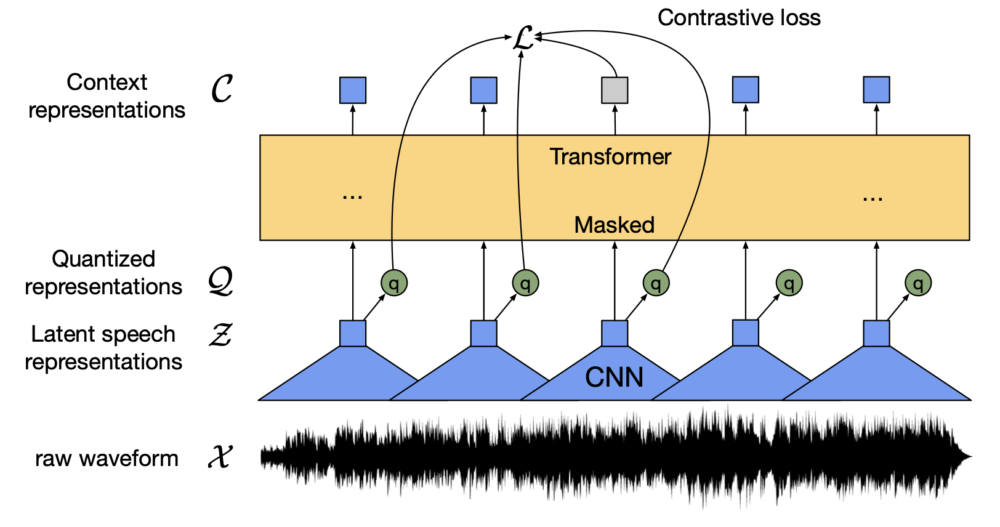
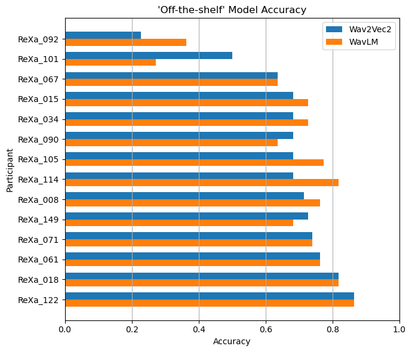
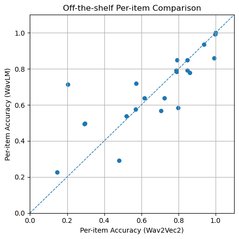
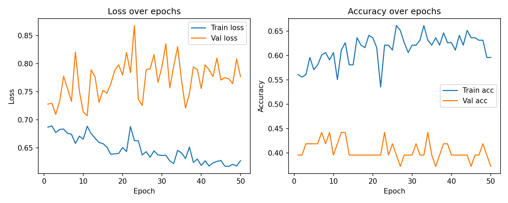
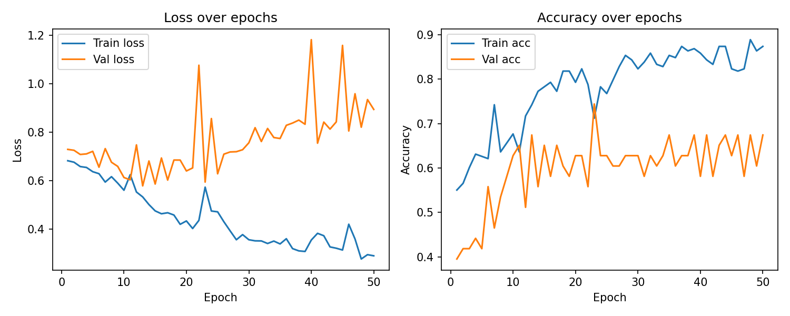

# PhonoCode: Transformer-Based Scoring of Phonological Tasks

This repo contains code for experimenting with transformer-based speech models (e.g., Whisper, Wav2Vec2, WavLM) to *automatically score* phonological task responses.  
Each audio clip is classified as **correct (1)** or **incorrect (0)**.

## 1. Problem

### 1.1 Lab context

The Communication and Language Lab (CaLL) studies **individual differences in language processing**. One task we use is **phoneme reversal**:

- Participants hear a **nonword** created by reversing the sounds of a real word.
- They must **reverse it back** to say the real word.
  - Example: hear /næ/ → respond /æn/ (“an”)
  - Example: hear /tʊp/ → respond /pʊt/ (“put”)

For this pilot:

- **14 participants × 22 audio files each** (`.wav`)
- Each file *should* be a single spoken response (the reversed nonword).
- We have manually coded ground truth for each response (correct vs incorrect).

### 1.2 Why this matters

Right now:

- Each participant is **live-coded** by a research assistant (RA) during the session.
- Then **re-coded from audio** by a second RA for inter-rater reliability.
- Each RA needs ~**5 hours of training** just to learn the scoring scheme.
- In many psychology labs, **data entry + validation is a major time (and money) sink**.

The ROI:

- Reduce time spent on repetitive coding.
- Free RAs for more interesting work (experiment design, analysis).

### 1.3 Why transformer-based speech models?

The audio is messy:

- RAs talking in the background / giving clarifying instructions.
- Variable mic quality; some trials cut off early or have room noise.
- Participants may hesitate, mispronounce, or add extra material before/after the target word.

We need a system that:

- Is **robust to noise and channel variation**.
- Can work **with limited labeled data** (we have ground truth but not a huge corpus).
- Can **generalize across speakers**, not just memorize specific voices.
- Eventually supports **confidence scores** so low-confidence trials can be flagged for human review.

Self-supervised and weakly-supervised transformer models (Whisper, Wav2Vec 2.0, WavLM) are built exactly for this kind of setting: they learn rich speech representations from huge unlabeled or weakly labeled corpora, then can be adapted with relatively small labeled datasets.

---

## 2. Models compared

This project compares two strong ASR backbones:

- **Wav2Vec 2.0** – self-supervised encoder trained with a contrastive objective on quantized latent speech.
- **WavLM** – Wav2Vec 2.0 / HuBERT-style encoder optimized for a broad “full stack” of speech tasks.

### 2.1 Wav2Vec 2.0

*Figure 1. Wav2Vec 2.0 Model Architecture from Baevski et al., 2020*

- **Self-supervised** transformer encoder trained directly on raw waveforms.
- Uses a CNN feature encoder → masks portions of latent features → Transformer context network → contrastive loss over **quantized speech units**.  
- Extremely **label-efficient**: with only 10 minutes of labeled Librispeech data, it reaches WER 4.8 / 8.2 (test-clean / test-other), and with full data it achieves state-of-the-art WER while using far less labeled data than previous approaches.

In our pipeline, Wav2Vec 2.0 is used **off-the-shelf** (no additional fine-tuning) as a baseline and as a **frozen encoder**: we extract embeddings for each audio file and train a small classifier head to predict correct (1) vs incorrect (0).

### 2.2 WavLM

*Figure 2. WavLM Model Architecture from Chen et al., 2022*

- Built on the Wav2Vec 2.0 / HuBERT family but optimized as a **general-purpose speech representation** model for a wide range of tasks (SUPERB benchmark).  
- Adds structured denoising and additional pretraining data (MIX-94k) to better capture speaker, background and other acoustic information.  
- Achieves **SOTA or near-SOTA results** across tasks like speech separation, speaker verification, diarization, and ASR.  

We again use WavLM both **off-the-shelf** as a **frozen encoder** plus a small classifier head, and compare performance to Wav2Vec 2.0 on the same splits.

## 3. Experimental design

### 3.1 Phase 1 – Out-the-shelf models + regex / fuzzy matching

Main idea: **“What if we just use off-the-shelf ASR and some string matching?”**

Steps:

1. Run WavLM and Wav2Vec 2.0 to **transcribe** each response.
2. Use **regex + fuzzy string matching** to decide if the transcript matches:
   - The expected reversed word.
   - A set of acceptable variants / spellings.
3. Evaluate against the manually coded ground truth (0/1).

*Figure 3. Off-the-shelf model accuracy per participant is unremarkable.*

*Figure 4. Off-the-shelf model accuracy per task item. Correct answers are anonymized. Diagonal line indicates equal performance between models.*

What we see:

- Works *okay* for clean, clear productions.
- **Homophones** are a major problem (e.g., orthographic ambiguity).
- It always outputs *some* word, even when the participant response is incomplete or non-target (“an” vs “Anne”, “put” vs “putt”).
- We’d still need humans to manually inspect borderline / noisy cases, so it doesn’t actually save that much time.

Conclusion: this is a reasonable baseline, but **purely transcript-based scoring is not enough** for this task.

### 3.2 Phase 2 – Frozen encoders + binary classifier

Goal: **Stop transcribing; directly classify the waveform** as correct or incorrect.

Pipeline:

1. Freeze a pre-trained encoder (Wav2Vec 2.0 or WavLM).
2. For each audio file:
   - Pass the waveform through the encoder.
   - Pool the hidden states into a fixed-length vector.
3. Train a small classifier head (e.g., logistic regression or a tiny MLP) on top of these embeddings to predict **0/1**.
4. Use **participant-grouped splits** so speakers in the test set are unseen during training.

*Figure 5. WavLM MLP Learning Curves show overfitting.*

*Figure 6. Wav2Vec 2.0 MLP Learning Curves also show overfitting but promising for next iteration.*

Empirical takeaway (pilot):

- For this phoneme-reversal classification task:
  - **Wav2Vec 2.0 features separated “correct” vs “incorrect”** responses more cleanly; the classifier generalized better to new participants.
  - **WavLM features tended to overfit speakers** more in this setup, with weaker generalization at this small data scale.
- In other words, **for this specific task and dataset size, “frozen Wav2Vec 2.0 + small head” beat “frozen WavLM + same head”**, despite WavLM’s stronger performance on broad benchmarks.
- Bonus: the homophone problem from earlier disappears!

Given the current tiny dataset and simple head, **Wav2Vec 2.0 was an easier representation space for the classifier** to carve out a good decision boundary.

### 3.3 Metrics

Right now the emphasis is on:

- **Accuracy** and **confusion matrices** for correct vs incorrect.
- **Participant-wise splits** (no speaker leakage) to avoid over-optimistic results.
- Later we’ll add **ROC curves, AUC, precision/recall**, and calibration analysis once the models are more stable.

---

## 4. Next steps

Since this will be my MSDS Capstone project, I have a few plans to use what I've learned to scale up.

Near-term:

- **Scale up Phase 2**:
  - Add more participants and more trials per participant.
  - Re-run Wav2Vec 2.0 vs WavLM under the same conditions with better regularization and more robust splitting.
- Add an **explicit confidence score** from the classifier head (or from calibrated probabilities).
  - Use this to set a **threshold for human review**.
  - High-confidence predictions → auto-accepted.
  - Low-confidence predictions → flagged for RA check.

Longer-term:

- Turn this pipeline into a **general tool for psycholinguistics labs**:
  - UI for uploading audio and viewing scores.
  - Visualizations of confidence and error patterns across participants.
  - Hooks for exporting data directly into analysis pipelines (R, Python, etc.).
- Explore **multi-class labels** (e.g., partial credit, specific error types) rather than just binary correct/incorrect.
- Investigate **transfer to other speech tasks** in the lab (e.g., other production tasks, repetition, or lexical decision with spoken responses).

---

## 5. References

- **Wav2Vec 2.0** – Baevski et al., *Wav2Vec 2.0: A Framework for Self-Supervised Learning of Speech Representations*, NeurIPS 2020.  
- **WavLM** – Chen et al., *WavLM: Large-Scale Self-Supervised Pre-Training for Full Stack Speech Processing*, IEEE/ACM TASLP 2022.  
